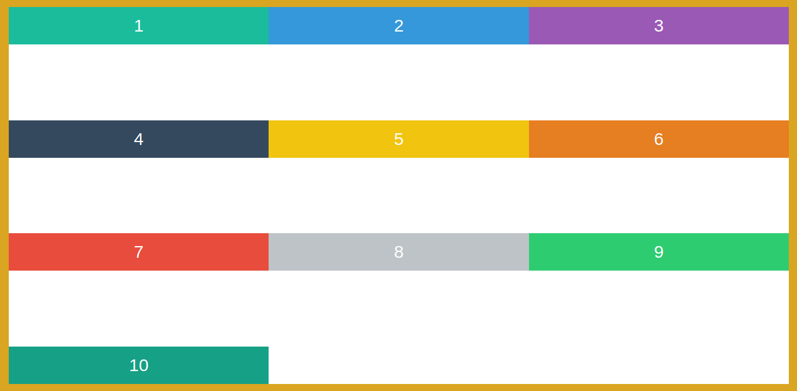

# Styles

## Html Structure that we are dealing with

```html
    <div class="container">
        <div class="box box1">1</div>
        <div class="box box2">2</div>
        <div class="box box3">3</div>
        <div class="box box4">4</div>
        <div class="box box5">5</div>
        <div class="box box6">6</div>
        <div class="box box7">7</div>
        <div class="box box8">8</div>
        <div class="box box9">9 </div>
        <div class="box box10">10</div>
  </div>
```

## 1. Introduction to Flexbox

1. `display: flex` - container covers the full width
    
2. `display: inline-flex` - container only extends according to the flex items within it and wraps them without leaving gaps.
    
3. `height: 100vh` - the flex items stretches the full height of the container
    

## 2. Working with Flexbox flex-direction

1. Main axis

    

1. Cross axis

    

1. `flex-direction: column` - changes the flex direction from default **row** to **column**

    

1. Other **flex-direction** properties : 
    * `row-reverse`
    * `column-reverse`

## 3. Wrapping elements with Flexbox

* In a flex layout if the flex-items within the container needs more space than the container provides, by default, the layout does not break and no wrapping occurs.The layout tries to evenly fit the flex items.

    * `flex-wrap: nowrap;` - this is the default value.  notice that each flex item tries to stretch across the full height of the container
    

    * `flex-wrap: wrap;` - unlike previous image the flex items stretches full container height but also splits up the space equally among themselves.
    
    
        
    * But for `wrap` to work we need to give the flex-items a width. and create a situation when there is lack of space in a single row.

        ```diff
        .box{
        +   width: 300px;   
        }
        ```

    * How can we get rid of the empty space after each row and stretch the whole width of the container ? :

        ```diff
        .box{
        -   width: 300px;
        +   width: 33.3333333%
        }
        ```
        

    * Changing the axis and then wrapping with limited height? See the output. Think why?

        ```diff
        .container {
            display:flex;
            border:10px solid goldenrod;  
        +    height: 100vh;
        +    flex-direction: column;
        +    flex-wrap: wrap;
        }
        ```
        

    * With the container having `flex-direction: row;` Margin on the flex-items ( with percentage width to cover the whole countainer width ) breaks the layout.

        ```diff
        .box{
        -    width: 33.3333333%; //this breaks layout
        +    width: calc(33.3333333% - 20px); //this fixes the layout with margin
        +    margin: 10px; // Margin is not part of the box model
        }
        ```
        

    * While since **border** and **padding** are part of the box model they do not break the layout.

        ```diff
        .box{
            width: 33.3333333%;
            /* margin: 10px; */
            /* padding: 10px; */
        +    border: 5px solid mistyrose; 
        }
        ```
        


## 4. Flexbox Ordering

> These properties are not set on the container. Rather they are set on the **flex-items**"

1. `flex: 1` - when this property is set on the flex items, it causes the items to evenly distribute themselves across the width of the container wihtout leaving any space.
    ```css
    .box{
        /* width: 33.3333333%; */ this does not work with "flex" property
        flex: 1;
    }
    ```
    

2. `order: 1` - the default order of all the flex items is 0. So it will apply the order accordingly after sorting.

    ```css
    .box{
    flex: 1;
    order: 0; /* this is default value */
    }

    .box3 {
    order: -1
    }

    .box7 {
    order: 1
    }
    ```
    

## 5. Flexbox Alignment and Centering with justify-content

* Remember ! There are two **axis** 

    1. main axis
    2. cross axis

* `justify-content` - defines how are the items alligned on the <span style="font-size:30px">main axis</span>. This property is defined inside the **container** having the flex-items.

#### Some property values and their results 

1. `justify-content: flex-start;`
    
1. `justify-content: flex-end;`
    
1. `justify-content: center;`
    
1. `justify-content: space-between;`
    
1. `justify-content: space-around;`
    

#### See how we loose the spacing if we just change the flex-direction

```diff
.container{
...
...
justify-content: space-around;
+ flex-direction: column;
}
```

**Why** with the flex-direction change we loose all the nice spacing that was created before.

> **Because** there is no limit in the height of container and the child boxes are too large to leave any space.


**How** to solve this issue: 
```diff
.box {
+  font-size: 20px; 
//to ensure that the child boxes are small enough in **height** to leave out spaces which can get distributed.
}
.container {
  display:flex;
  justify-content: space-around;
  flex-direction: column;
+ min-height: 100vh; //otherwise the container would naturally take the height it requires for its child boxes to fit in. 
}
```


#### Vertically centering - with flex-direction as `column`
Use the following inside the container

```diff
+ justify-content: center;
  flex-direction: column;
```


## 6. Alignment and Centering with align-items

* `align-items` - defines how are the items alligned on the <span style="font-size:30px">cross axis</span>. This property is defined inside the **container** having the flex-items.

```diff
.container {
  display:flex;
  border:10px solid goldenrod;  
+ align-items: center;
}
```

Why does the align-items property does not have any impact. Because the container does not have a fixed height, at least to start with.

#### Some property values and their results 

1. `align-items: stretch;` - this is the default.         Flex items Stretches across the container
    

1. `align-items: center;`
    

1. `align-items: flex-start;`
    

1. `align-items: flex-end;`
    

1. `align-items: baseline;`
    _Changing the font size of the boxes_
    ```css
    .box1 { font-size: 10px}
    .box2 { font-size: 20px}
    .box3 { font-size: 40px}
    ```
    

#### See the effect if we just change the flex-direction

```diff
.container{
...
...
align-items: center;;
+ flex-direction: column;
}
```


## 7. Alignment and Centering with align-content

`justify-content` - defines what happens to the extra space in the <span style="font-size:30px">main axis</span>.

`align-content` -  defines what happens to the extra space in the <span style="font-size:30px">cross axis</span>.

#### Some property values and their results 

To see the effect of align-content we need to have `flex-wrap: wrap` in the container and set a width for the boxes: `.box{width: 33.3333%}`.
So the effect of align-content is only visible when we have **multiple lines** of child boxes.

1. `align-content: stretch;` - this is the default.Flex items stretches vertically across the container
    

1. `align-content: center;`
    

1. `align-content: flex-start;`
    

1. `align-content: flex-end;`
    

1. `align-content: space-between;`   
    

1. `align-content: space-around;`   
    

1. What if you wanted the `10` to be in the center? Using `text-align: center` in the container wont work.

    ```css
    .container {
        ...
        justify-content: center;
        align-content: center;
    }
    ```
    


## 8. Alignment and Centering with align-self

**Scenario** to start working with align-self

```css
.container {
  display:flex;
  border:10px solid goldenrod;  
  height: 100vh;
  align-items: flex-start;
}
.box {
  flex: 1
}
.box2{padding-bottom: 200px;} 
.box6{padding-bottom: 0;} 
.box9{padding-bottom: 50px;} 
```


**Note** that `align-items: flex-start;` inside the container causes all the items to stay at the top along- the cross axis.

**But** what if we wanted box **`9`** to move at the bottom along the cross axis by overring the align-items property set in the container?

```diff
.box9{
  padding-bottom: 50px;
+  align-self: flex-end;
} 
```


You can use all other property values : 
`center, stretch, flex-start, baseline,etc` 

## 9. Understanding Flexbox sizing with the flex property

**`flex`** determines at what **proportion** or **ratio** should I scale myself up or down when there is extra space or when there is no space. This is defined on the child boxes.

* Scenario for using **`flex`** property

    ```css
    .container {
        display:flex;
        border:10px solid goldenrod;    
    }
    .box {
    /* need to use flex property here. */
    }

    ```
    

* `flex: 1` 

    ```diff
    .box {
    + flex: 1;
    }
    ```
    

* Boxes with different ratio

    ```diff
    .box {
        flex: 1;
    }

    .box2 {
    +    flex: 2;
    }

    .box5 {
    +    flex: 3;
    }
    ```
    


## 10. Finally understanding Flexbox flex-grow, flex-shrink and flex-basis

`flex` property has 3 properties packed up inside it:

* `flex-grow` - when i have extra space how should we divide <span style="font-size:30px;color:red; font-weight: bold">the extra space</span> among everybody on the same line and grow the size.

* `flex-shrink` - when i dont have enough space how should we divide <span style="font-size:30px;color:red; font-weight: bold">the extra space</span> among everybody on the same line and slim down the size.

* `flex-basis` - defines how wide or high our elements will be before evaluating the `flex-grow` or `flex-shrink` properties.
   
* Setting up the scenario
  
  ```css
  .box1 {
    flex-basis: 400px;
  }
  .box2 {
    flex-basis: 400px;
  }
  ```
     

* What will happen with the following change?

    ```diff
    .box1 {   
        flex-basis: 400px; 
    +   flex-grow: 1;   
    }
    .box2 {   
        flex-basis: 400px;    
    }
    ```
    
    
    * box1 which is assigned `flex-grow: 1` takes up the entire empty space while 
    * box2 retains its original width set by `flex-basis: 400px;`
    * this shows that the default is `flex-grow: 0` which is set for box2. Thus it never grows although extra space is available.

* Setting `flex-grow: 1` for both boxes.
    
    * Now the extra space gets divided equally. 
     
* Unequal `flex-grow` properties.

    ```diff
    .box1 {     
        flex-basis: 400px; 
    +   flex-grow: 10;   
    }
    .box2 {   
        flex-basis: 400px;    
    +   flex-grow: 1; 
    }
    ```
    
    
    * **box1** takes 10 times the extra space than **box2**.

* With `flex-shrink` change the behaviour when there is no extra space. Default is `flex-shrink: 1`

    ```diff
    .box1 {   
        flex-basis: 400px; 
        flex-grow: 10;   
    +   flex-shrink: 10; // this means shrink by the ratio of 10 wrt to decrese in space.
    }
    .box2 {   
        flex-basis: 400px;
        flex-grow: 1;
    +   flex-shrink: 1; // this means shrink by the ratio of 1 wrt to decrese in space.
    }
    ```
    
    * box1 is shrinked 10 times more than box2 when there is lack of space.

* Short-hand 

    ```diff
    .box1 {   
    -    flex-basis: 400px; 
    -    flex-grow: 10;   
    -    flex-shrink: 5;

    +    flex: 10 5 400px
    }
    ```

## 11. How Flexbox's flex-basis and wrapping work together

* <span class='question'>Why</span> does the following does not cause the items to grow vertically when we see that there is enough space below ?

    ```css
    .container {
        border: 10px red solid;
        display:flex;    
        flex-direction: column;
    }
    .box {
        flex-grow: 1;
    }
    .box3{
        flex-grow: 5;
    }    
    ```

    
    Because the container does not have a height to provide any extra space.

    <span class="answer">Change</span> the css as below to see the effect of `flex-grow` vertically.

    ```diff
    .container {
        border: 10px red solid;
        display:flex;    
    +   height: 100vh;
    +   flex-wrap: wrap; //causes the items to wrap to the side once space is not enough in the first column.        
        flex-direction: column;
    }
    ```
     
    

<!-- ## 12. Cross Browser Flexbox Support and Autoprefixer!

1. Autoprefixer 
1. Gulp, Grunt 
1. install Node
1. Install Gulp
    1. `$ npm install gulp -g` - install gulp globally on local machine.
    1. `$ touch gulpfile.js` - creates a gulp file to track what we are doing
1. package.json file
1. Install some more packages 
    1. `npm install gulp --save-dev`
    1. `npm install gulp-autoprefixer --save-dev`
1. Code in the gulp.js js file and implement autoprefixer by creating a task
1. We get an output style.css file which is autoprefixed.
1. Make another task - which will automatically watch your css files and build whenever they are changed. -->


<style>
.question{
    font-size: 30px;
    color: red;
}
.answer{
    font-size: 30px;
    color: darkblue;
}
</style>
